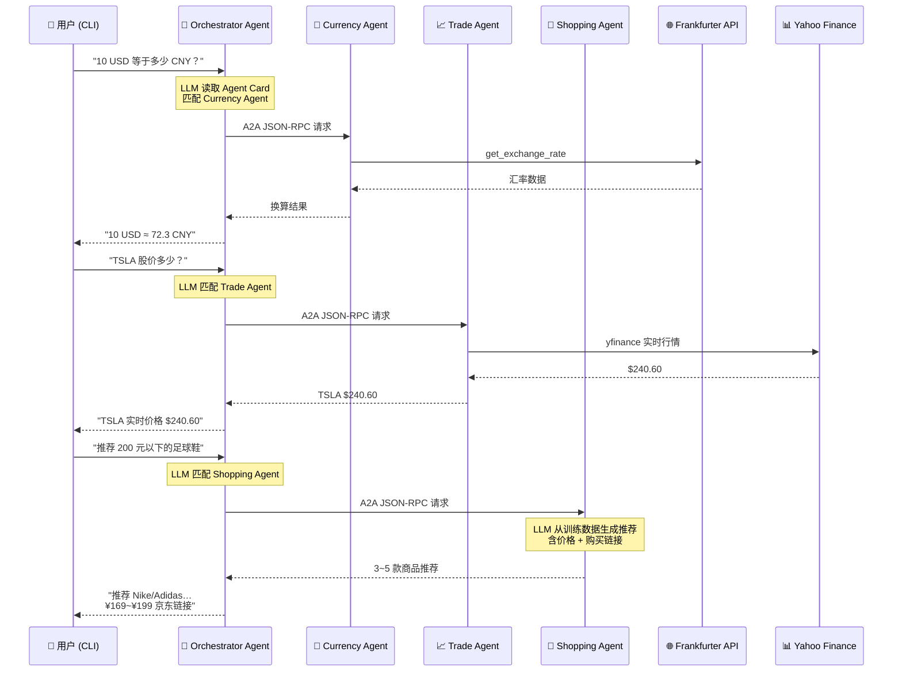

# A2A 多 Agent 协作演示

基于 Google [A2A](https://github.com/google/A2A) 协议构建的多 Agent 协作演示项目，使用 [LangGraph](https://langchain-ai.github.io/langgraph/) + ReAct 模式。包含一个通用 **Orchestrator Agent**（调度 Agent）通过 Agent Card 自动发现并调度多个 A2A Server。兼容 **Gemini** 与 **DeepSeek** 等 OpenAI API 格式的 LLM 服务。

## 架构概览

```
用户 (CLI)
    │
    ▼
Orchestrator Agent (LLM 驱动)
    │       通过 A2A 协议 + JSON-RPC
    ├──► Currency Agent Server  (端口 10000)  ──► Frankfurter API
    ├──► Trade Agent Server     (端口 10001)  ──► Yahoo Finance
    └──► Shopping Agent Server  (端口 10002)  ──► LLM 内置知识
```



## 主要特性

- **通用调度 Agent**：Orchestrator 通过 Agent Card 自动发现远端 Agent 能力，LLM 智能决策调度
- **多轮对话**：信息不足时可主动向用户追问，支持跨轮次上下文保持
- **实时流式响应**：处理过程中提供状态更新
- **对话记忆**：跨交互保持上下文
- **多模型支持**：兼容 Google Gemini / DeepSeek / OpenAI 等多种 LLM
- **货币汇率工具**：集成 Frankfurter API 获取实时汇率（Currency Agent）
- **实时股票交易**：通过 Yahoo Finance 获取真实行情，支持搜索、持仓管理、模拟下单（Trade Agent）
- **LLM 商品推荐**：利用 LLM 训练数据直接生成商品推荐，含价格、描述、购买链接（Shopping Agent）
- **多 Server 扩展**：通过 `A2A_SERVER_URLS` 接入任意数量的 A2A Server

## 前置条件

- Python 3.12+
- [UV](https://docs.astral.sh/uv/) 包管理器
- 对应 LLM 的 API Key（Gemini / DeepSeek / OpenAI 等）

## 环境变量配置

项目根目录下创建 `.env` 文件，根据使用的模型设置相应变量。参考模板如下：

```bash
# ============================================
# 模型来源选择（optional）
# 可选值：google | 自定义 （默认 google）
# ============================================
model_source=deepseek

# ============================================
# Google Gemini 配置（model_source=google 时使用）
# ============================================
GOOGLE_API_KEY=your_google_api_key_here

# ============================================
# model_source=openai 时使用
# 兼容任何 OpenAI API 格式的服务
# ============================================
# API Key（某些本地服务如 Ollama 可不填）
API_KEY=your_api_key_here
# BaseURL 地址，例如：
TOOL_LLM_URL=https://api.deepseek.com
# 模型名称，例如：
TOOL_LLM_NAME=deepseek-v4-flash

# ============================================
# Orchestrator Agent 要连接的 A2A Server 列表
# 逗号分隔多个地址，不设则默认连接 http://localhost:10000
# ============================================
A2A_SERVER_URLS=http://localhost:10000,http://localhost:10001,http://localhost:10002
```

## 快速启动

1. 安装依赖：

   ```bash
   uv sync
   ```

2. 启动agent服务器（默认端口 10000）：

   ```bash
   uv run app
   ```

   自定义主机和端口：

   ```bash
   uv run app --host 0.0.0.0 --port 8080
   ```

3. （可选）启动股票交易 Agent（默认端口 10001）：

   ```bash
   uv run python app/trade --port 10001
   ```

4. （可选）启动购物推荐 Agent（默认端口 10002）：

   ```bash
   uv run python app/shop --port 10002
   ```

5. 另开终端，运行调度 Agent（Orchestrator）：

   ```bash
   # 单 Server（默认 http://localhost:10000）
   uv run python app/cli_agent.py

   # 多 Server（货币 + 交易 + 购物）
   # 或直接在 .env 中设置 A2A_SERVER_URLS
   A2A_SERVER_URLS=http://localhost:10000,http://localhost:10001,http://localhost:10002 uv run python app/cli_agent.py
   ```

### Orchestrator Agent（调度 Agent）

`cli_agent.py` 是一个基于 LLM 的通用调度 Agent（Orchestrator），展示 A2A 协议的核心用法——**Agent 与 Agent 通信**。

```
用户 (CLI)  ←→  Orchestrator Agent (LLM 驱动)
                     │ 通过 A2A 协议 + JSON-RPC
                     ├── Currency Agent Server  (app/__main__.py — 端口 10000)
                     ├── Trade Agent Server     (app/trade/ — 端口 10001)
                     └── Shopping Agent Server  (app/shop/ — 端口 10002)
```

其工作流程：

1. 启动时通过 `A2ACardResolver` 拉取**所有远程 Server 的 Agent Card**，自动发现其能力（名称、描述、技能列表、支持的输入输出格式）
2. 将所有 Agent Card 的原始 JSON 直接注入 LLM 的 system prompt，LLM 自行读取卡中字段来决定调度
3. 注册一个 Tool `call_a2a_agent(server_url, query)`，负责将自然语言包装为 A2A JSON-RPC 请求发给对应 Server
4. 在 CLI 中与用户自然语言交互，LLM 根据 Agent Card 信息判断请求匹配哪个远程 Agent，智能调度

> 该调度 Agent 和所有 Server 使用相同环境变量（`model_source` / `GOOGLE_API_KEY` / `TOOL_LLM_URL` / `TOOL_LLM_NAME` / `API_KEY`）。

## Trade Agent（股票交易 Agent）

`app/trade/` 是一个独立的 A2A Agent Server，通过 **Yahoo Finance** 获取真实行情：

- **实时行情**：通过 yfinance 获取美股真实价格（如 AAPL、TSLA、NVDA）
- **股票搜索**：按关键词搜索匹配的股票代码
- **投资组合**：查看持仓与账户余额（按实时价格计算市值）
- **模拟下单**：模拟买入/卖出，含资金与持仓校验
- **订单历史**：查看过往交易记录
- **模拟入金**：为模拟账户补充资金

> 行情为真实数据，账户与订单为进程级内存模拟，重启即重置。

启动方式：

```bash
uv run python app/trade --port 10001
```

## Shopping Agent（商品推荐 Agent）

`app/shop/` 利用 LLM 训练数据直接生成商品推荐，无需外接商品数据库：

- **LLM 驱动推荐**：LLM 根据用户的自然语言需求（如"200元以下的足球鞋"）从训练数据中提取真实商品信息
- **含购买链接**：每款推荐附带京东搜索链接，可直接打开购买
- **中国市场定价**：价格切合 2025~2026 年中国市场实际参考价

> 商品信息来自 LLM 训练数据（截至其知识截止日期），仅供参考。

启动方式：

```bash
uv run python app/shop --port 10002
```

## 构建容器镜像

也可通过 Containerfile 构建容器镜像：

```bash
podman build . -t langgraph-a2a-server
```

> [!Tip]
> Podman 可直接替换为 `docker`。

运行容器：

```bash
podman run -p 10000:10000 --env-file .env langgraph-a2a-server
```

> [!Important]
> * **访问 URL**：客户端需通过 `0.0.0.0:10000` 访问服务，使用 `localhost` 将无法正常工作。
> * **Hostname 覆盖**：如果容器内主机名与外部不一致，可通过 `HOST_OVERRIDE` 环境变量指定 Agent Card 中的主机名。

## 技术实现

- **LangGraph ReAct Agent**：采用 ReAct 模式进行推理与工具调用
- **流式支持**：处理过程中提供增量更新
- **Checkpoint Memory**：跨轮次维护对话状态
- **推送通知系统**：基于 Webhook 的更新，支持 JWK 认证
- **A2A 协议集成**：完全符合 A2A 规范

## 局限性

- 仅支持文本输入/输出（不支持多模态）
- Currency Agent 使用 Frankfurter API，支持的币种有限
- Trade Agent 行情来自 Yahoo Finance（免费 API，有频率限制）；账户与订单为内存模拟，重启即重置
- Shopping Agent 商品信息来自 LLM 训练数据，价格可能存在时效偏差，仅供参考
- 对话记忆基于会话，服务重启后不持久化

## API 调用示例

**同步请求**

请求：

```
POST http://localhost:10000
Content-Type: application/json

{
    "id": "12113c25-b752-473f-977e-c9ad33cf4f56",
    "jsonrpc": "2.0",
    "method": "message/send",
    "params": {
        "message": {
            "kind": "message",
            "messageId": "120ec73f93024993becf954d03a672bc",
            "parts": [
                {
                    "kind": "text",
                    "text": "how much is 10 USD in INR?"
                }
            ],
            "role": "user"
        }
    }
}
```

响应：

```
{
    "id": "12113c25-b752-473f-977e-c9ad33cf4f56",
    "jsonrpc": "2.0",
    "result": {
        "artifacts": [
            {
                "artifactId": "08373241-a745-4abe-a78b-9ca60882bcc6",
                "name": "conversion_result",
                "parts": [
                    {
                        "kind": "text",
                        "text": "10 USD is 856.2 INR."
                    }
                ]
            }
        ],
        "contextId": "e329f200-eaf4-4ae9-a8ef-a33cf9485367",
        "history": [
            {
                "contextId": "e329f200-eaf4-4ae9-a8ef-a33cf9485367",
                "kind": "message",
                "messageId": "120ec73f93024993becf954d03a672bc",
                "parts": [
                    {
                        "kind": "text",
                        "text": "how much is 10 USD in INR?"
                    }
                ],
                "role": "user",
                "taskId": "58124b63-dd3b-46b8-bf1d-1cc1aefd1c8f"
            },
            {
                "contextId": "e329f200-eaf4-4ae9-a8ef-a33cf9485367",
                "kind": "message",
                "messageId": "d8b4d7de-709f-40f7-ae0c-fd6ee398a2bf",
                "parts": [
                    {
                        "kind": "text",
                        "text": "Looking up the exchange rates..."
                    }
                ],
                "role": "agent",
                "taskId": "58124b63-dd3b-46b8-bf1d-1cc1aefd1c8f"
            },
            {
                "contextId": "e329f200-eaf4-4ae9-a8ef-a33cf9485367",
                "kind": "message",
                "messageId": "ee0cb3b6-c3d6-4316-8d58-315c437a2a77",
                "parts": [
                    {
                        "kind": "text",
                        "text": "Processing the exchange rates.."
                    }
                ],
                "role": "agent",
                "taskId": "58124b63-dd3b-46b8-bf1d-1cc1aefd1c8f"
            }
        ],
        "id": "58124b63-dd3b-46b8-bf1d-1cc1aefd1c8f",
        "kind": "task",
        "status": {
            "state": "completed"
        }
    }
}
```

**Multi-turn example**

Request - Seq 1:

```
POST http://localhost:10000
Content-Type: application/json

{
    "id": "27be771b-708f-43b8-8366-968966d07ec0",
    "jsonrpc": "2.0",
    "method": "message/send",
    "params": {
        "message": {
            "kind": "message",
            "messageId": "296eafc9233142bd98279e4055165f12",
            "parts": [
                {
                    "kind": "text",
                    "text": "How much is the exchange rate for 1 USD?"
                }
            ],
            "role": "user"
        }
    }
}
```

Response - Seq 2:

```
{
    "id": "27be771b-708f-43b8-8366-968966d07ec0",
    "jsonrpc": "2.0",
    "result": {
        "contextId": "a7cc0bef-17b5-41fc-9379-40b99f46a101",
        "history": [
            {
                "contextId": "a7cc0bef-17b5-41fc-9379-40b99f46a101",
                "kind": "message",
                "messageId": "296eafc9233142bd98279e4055165f12",
                "parts": [
                    {
                        "kind": "text",
                        "text": "How much is the exchange rate for 1 USD?"
                    }
                ],
                "role": "user",
                "taskId": "9d94c2d4-06e4-40e1-876b-22f5a2666e61"
            }
        ],
        "id": "9d94c2d4-06e4-40e1-876b-22f5a2666e61",
        "kind": "task",
        "status": {
            "message": {
                "contextId": "a7cc0bef-17b5-41fc-9379-40b99f46a101",
                "kind": "message",
                "messageId": "f0f5f3ff-335c-4e77-9b4a-01ff3908e7be",
                "parts": [
                    {
                        "kind": "text",
                        "text": "Please specify which currency you would like to convert to."
                    }
                ],
                "role": "agent",
                "taskId": "9d94c2d4-06e4-40e1-876b-22f5a2666e61"
            },
            "state": "input-required"
        }
    }
}
```

Request - Seq 3:

```
POST http://localhost:10000
Content-Type: application/json

{
    "id": "b88d818d-1192-42be-b4eb-3ee6b96a7e35",
    "jsonrpc": "2.0",
    "method": "message/send",
    "params": {
        "message": {
            "contextId": "a7cc0bef-17b5-41fc-9379-40b99f46a101",
            "kind": "message",
            "messageId": "70371e1f231f4597b65ccdf534930ca9",
            "parts": [
                {
                    "kind": "text",
                    "text": "CAD"
                }
            ],
            "role": "user",
            "taskId": "9d94c2d4-06e4-40e1-876b-22f5a2666e61"
        }
    }
}
```

Response - Seq 4:

```
{
    "id": "b88d818d-1192-42be-b4eb-3ee6b96a7e35",
    "jsonrpc": "2.0",
    "result": {
        "artifacts": [
            {
                "artifactId": "08373241-a745-4abe-a78b-9ca60882bcc6",
                "name": "conversion_result",
                "parts": [
                    {
                        "kind": "text",
                        "text": "The exchange rate for 1 USD to CAD is 1.3739."
                    }
                ]
            }
        ],
        "contextId": "a7cc0bef-17b5-41fc-9379-40b99f46a101",
        "history": [
            {
                "contextId": "a7cc0bef-17b5-41fc-9379-40b99f46a101",
                "kind": "message",
                "messageId": "296eafc9233142bd98279e4055165f12",
                "parts": [
                    {
                        "kind": "text",
                        "text": "How much is the exchange rate for 1 USD?"
                    }
                ],
                "role": "user",
                "taskId": "9d94c2d4-06e4-40e1-876b-22f5a2666e61"
            },
            {
                "contextId": "a7cc0bef-17b5-41fc-9379-40b99f46a101",
                "kind": "message",
                "messageId": "f0f5f3ff-335c-4e77-9b4a-01ff3908e7be",
                "parts": [
                    {
                        "kind": "text",
                        "text": "Please specify which currency you would like to convert to."
                    }
                ],
                "role": "agent",
                "taskId": "9d94c2d4-06e4-40e1-876b-22f5a2666e61"
            },
            {
                "contextId": "a7cc0bef-17b5-41fc-9379-40b99f46a101",
                "kind": "message",
                "messageId": "70371e1f231f4597b65ccdf534930ca9",
                "parts": [
                    {
                        "kind": "text",
                        "text": "CAD"
                    }
                ],
                "role": "user",
                "taskId": "9d94c2d4-06e4-40e1-876b-22f5a2666e61"
            },
            {
                "contextId": "a7cc0bef-17b5-41fc-9379-40b99f46a101",
                "kind": "message",
                "messageId": "0eb4f200-a8cd-4d34-94f8-4d223eb1b2c0",
                "parts": [
                    {
                        "kind": "text",
                        "text": "Looking up the exchange rates..."
                    }
                ],
                "role": "agent",
                "taskId": "9d94c2d4-06e4-40e1-876b-22f5a2666e61"
            },
            {
                "contextId": "a7cc0bef-17b5-41fc-9379-40b99f46a101",
                "kind": "message",
                "messageId": "41c7c03a-a772-4dc8-a868-e8c7b7defc91",
                "parts": [
                    {
                        "kind": "text",
                        "text": "Processing the exchange rates.."
                    }
                ],
                "role": "agent",
                "taskId": "9d94c2d4-06e4-40e1-876b-22f5a2666e61"
            }
        ],
        "id": "9d94c2d4-06e4-40e1-876b-22f5a2666e61",
        "kind": "task",
        "status": {
            "state": "completed"
        }
    }
}
```

**Streaming example**

Request:

```
{
    "id": "6d12d159-ec67-46e6-8d43-18480ce7f6ca",
    "jsonrpc": "2.0",
    "method": "message/stream",
    "params": {
        "message": {
            "kind": "message",
            "messageId": "2f9538ef0984471aa0d5179ce3c67a28",
            "parts": [
                {
                    "kind": "text",
                    "text": "how much is 10 USD in INR?"
                }
            ],
            "role": "user"
        }
    }
}
```

Response:

```
data: {"id":"6d12d159-ec67-46e6-8d43-18480ce7f6ca","jsonrpc":"2.0","result":{"contextId":"cd09e369-340a-4563-bca4-e5f2e0b9ff81","history":[{"contextId":"cd09e369-340a-4563-bca4-e5f2e0b9ff81","kind":"message","messageId":"2f9538ef0984471aa0d5179ce3c67a28","parts":[{"kind":"text","text":"how much is 10 USD in INR?"}],"role":"user","taskId":"423a2569-f272-4d75-a4d1-cdc6682188e5"}],"id":"423a2569-f272-4d75-a4d1-cdc6682188e5","kind":"task","status":{"state":"submitted"}}}

data: {"id":"6d12d159-ec67-46e6-8d43-18480ce7f6ca","jsonrpc":"2.0","result":{"contextId":"cd09e369-340a-4563-bca4-e5f2e0b9ff81","final":false,"kind":"status-update","status":{"message":{"contextId":"cd09e369-340a-4563-bca4-e5f2e0b9ff81","kind":"message","messageId":"1854a825-c64f-4f30-96f2-c8aa558b83f9","parts":[{"kind":"text","text":"Looking up the exchange rates..."}],"role":"agent","taskId":"423a2569-f272-4d75-a4d1-cdc6682188e5"},"state":"working"},"taskId":"423a2569-f272-4d75-a4d1-cdc6682188e5"}}

data: {"id":"6d12d159-ec67-46e6-8d43-18480ce7f6ca","jsonrpc":"2.0","result":{"contextId":"cd09e369-340a-4563-bca4-e5f2e0b9ff81","final":false,"kind":"status-update","status":{"message":{"contextId":"cd09e369-340a-4563-bca4-e5f2e0b9ff81","kind":"message","messageId":"e72127a6-4830-4320-bf23-235ac79b9a13","parts":[{"kind":"text","text":"Processing the exchange rates.."}],"role":"agent","taskId":"423a2569-f272-4d75-a4d1-cdc6682188e5"},"state":"working"},"taskId":"423a2569-f272-4d75-a4d1-cdc6682188e5"}}

data: {"id":"6d12d159-ec67-46e6-8d43-18480ce7f6ca","jsonrpc":"2.0","result":{"artifact":{"artifactId":"08373241-a745-4abe-a78b-9ca60882bcc6","name":"conversion_result","parts":[{"kind":"text","text":"10 USD is 856.2 INR."}]},"contextId":"cd09e369-340a-4563-bca4-e5f2e0b9ff81","kind":"artifact-update","taskId":"423a2569-f272-4d75-a4d1-cdc6682188e5"}}

data: {"id":"6d12d159-ec67-46e6-8d43-18480ce7f6ca","jsonrpc":"2.0","result":{"contextId":"cd09e369-340a-4563-bca4-e5f2e0b9ff81","final":true,"kind":"status-update","status":{"state":"completed"},"taskId":"423a2569-f272-4d75-a4d1-cdc6682188e5"}}
```

## Learn More

- [A2A Protocol Documentation](https://a2a-protocol.org/)
- [LangGraph Documentation](https://langchain-ai.github.io/langgraph/)
- [Frankfurter API](https://www.frankfurter.app/docs/)
- [Google Gemini API](https://ai.google.dev/gemini-api)


## Disclaimer
Important: The sample code provided is for demonstration purposes and illustrates the mechanics of the Agent-to-Agent (A2A) protocol. When building production applications, it is critical to treat any agent operating outside of your direct control as a potentially untrusted entity.

All data received from an external agent—including but not limited to its AgentCard, messages, artifacts, and task statuses—should be handled as untrusted input. For example, a malicious agent could provide an AgentCard containing crafted data in its fields (e.g., description, name, skills.description). If this data is used without sanitization to construct prompts for a Large Language Model (LLM), it could expose your application to prompt injection attacks.  Failure to properly validate and sanitize this data before use can introduce security vulnerabilities into your application.

Developers are responsible for implementing appropriate security measures, such as input validation and secure handling of credentials to protect their systems and users.
